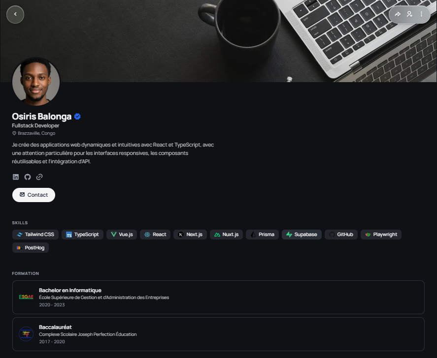

# Responsive Profile Page

Page profil responsive realisee avec HTML5 et CSS vanilla pour presenter un developpeur, ses competences, sa formation, ses reseaux sociaux et un formulaire de contact.



## Demo

- GitHub Pages : https://osiris-balonga.github.io/responsive-profile-page/
- Repository : https://github.com/Osiris-Balonga/responsive-profile-page

## Objectif

Ce projet repond au livrable de page profil responsive demande dans la phase HTML/CSS/Git. Il met l'accent sur une structure semantique, une interface mobile first, une adaptation desktop et un dark mode sans JavaScript.

## Fonctionnalites

- Header, navigation, contenu principal et footer
- Photo de profil, nom, bio, competences et formation
- Liens vers les reseaux sociaux
- Formulaire de contact accessible avec labels
- Overlay CSS-only pour la photo et le formulaire
- Dark mode CSS-only
- Layout responsive avec plusieurs breakpoints

## Technologies

- HTML5 semantique
- CSS3
- Variables CSS
- Google Fonts
- Remix Icon

## Structure

```text
responsive-profile-page/
  assets/
  index.html
  style.css
  README.md
```
